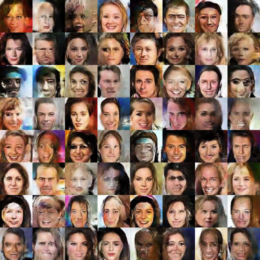

# Wasserstein GAN

This repository provides a Torch implementation of Wasserstein GAN as described by Arjovsky *et. al.* in their paper [Wasserstein GAN](https://arxiv.org/abs/1701.07875).



## Prerequisites
- Torch
- `cutorch`, `cunn` and `cudnn` to train the network on GPU. Training on CPU is supported but not recommended (very slow)

Please refer to the [official Torch website](http://torch.ch/docs/getting-started.html) to install Torch.

## Usage

1. Choose a dataset and create a folder with its name (ex: `mkdir celebA; cd celebA`). Inside this folder create another folder (`images` for example) containing your images.  
*Note:* You can download the celebA dataset on the [celebA web page](http://mmlab.ie.cuhk.edu.hk/projects/CelebA.html). Extract the images and run
```
DATA_ROOT=celebA th data/crop_celebA.lua
```

2. Train the Wasserstein model
```
DATA_ROOT=<dataset_folder> name=<whatever_name_you_want> th main.lua
```

The networks are saved into the `checkpoints/` directory with the name you gave.

3. Generate images
```
net=<path_to_generator_network> name=<name_to_save_images> th generate.lua
```
*Example:*
```
net=checkpoints/generator.t7 name=myimages display=2929 th generate.lua
```

The generated images are saved in `myimages.png`.

## Display images in a browser

If you want, install the `display` package (`luarocks install display`) and run
```
th -ldisplay.start <PORT_NUMBER> 0.0.0.0
```
to launch a server on the port you chose. You can access it in your browser with the url http://localhost:PORT_NUMBER.

To train your network or for completion add the variable `display=<PORT_NUMBER>` to the list of options.

## Optional parameters

In your command line instructions you can specify several parameters (for example the display port number), here are some of them:
+ `noise` which can be either `uniform` or `normal` indicates the prior distribution from which the samples are generated
+ `batchSize` is the size of the batch used for training or the number of images to reconstruct
+ `name` is the name you want to use to save your networks or the generated images
+ `gpu` specifies if the computations are done on the GPU or not. Set it to 0 to use the CPU (not recommended, too slow) and to n to use the nth GPU you have (1 is the default value)
+ `lr` is the learning rate
+ `loadSize` is the size to use to scale the images. 0 means no rescale
+ `niter` is the number of epochs for training

## References

- Original PyTorch implementation of Wasserstein GAN by the authors: https://github.com/martinarjovsky/WassersteinGAN
- The code is inspired from soumith's DCGAN implementation that can be found here: https://github.com/soumith/dcgan.torch
